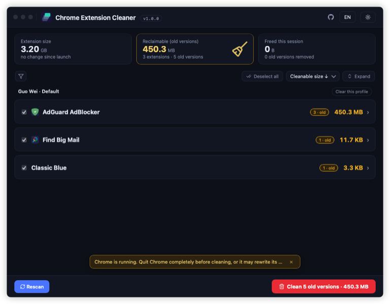
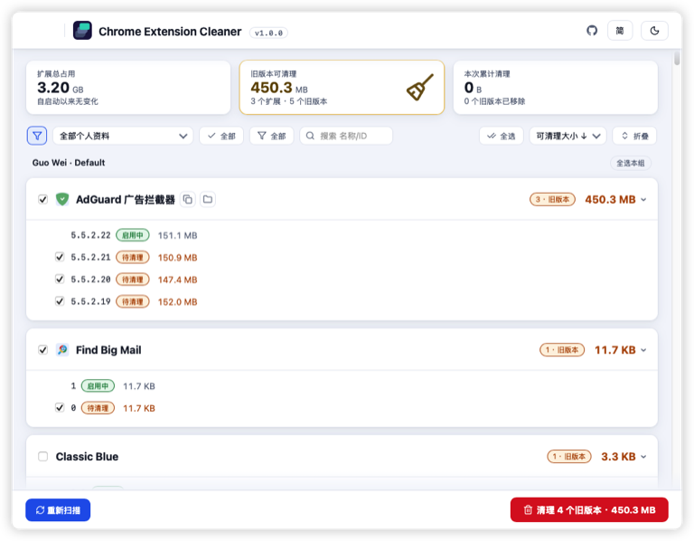
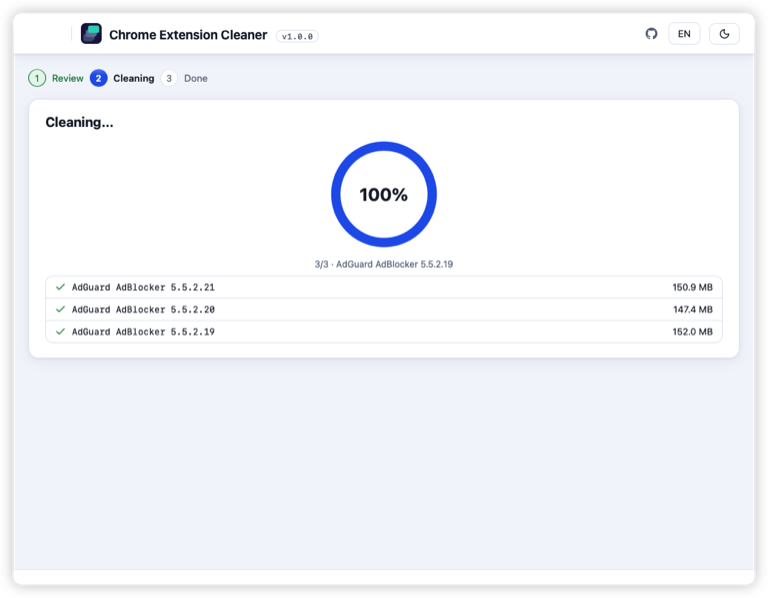
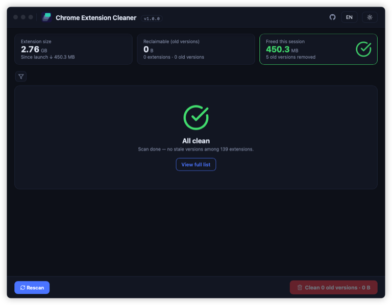

# Chrome Extension Cleaner

> [中文说明](README.zh-CN.md) · [Download](releases/latest)

Finds and removes **stale version folders of Chrome
extensions** across all your profiles — Chrome auto-updates extensions but
sometimes leaves old `<version>_0` folders behind, and each update of a large
extension (ad blockers, AI assistants, grammar tools) can leave hundreds of
megabytes that are never used again. Independent open-source project, not
affiliated with Google.

<table>
<tr>
<td></td>
<td></td>
</tr>
<tr>
<td></td>
<td></td>
</tr>
</table>

## Before you install

Supported platforms: macOS Apple Silicon, Windows x64, Linux x64

- Only **Google Chrome Stable** with its default user-data directory is
  supported — not Edge, Brave, Chromium, Beta, Dev, Canary, or a custom
  `--user-data-dir`.
- Builds are **unsigned experimental** and have **no auto-update**. On first
  launch, macOS Gatekeeper and Windows SmartScreen will warn; allow the app
  once in your OS security settings.
- This tool only removes stale extension version folders. It does **not**
  uninstall extensions, touch settings, or read your browsing data.

## Install

- **macOS** (`.dmg`): open the image, drag the app to Applications. On first
  launch, right-click → Open → confirm (or allow once in System Settings →
  Privacy & Security).
- **Windows** (`.exe`): SmartScreen will warn — choose "More info" → "Run
  anyway".
- **Linux** (AppImage / `.deb`): see the release notes for supported distros
  and WebView dependencies.

## Use

1. **Consider quitting Chrome first.** The app warns you if Chrome is still running.
2. Open the app — it scans every Chrome profile and lists extensions with stale
   versions, biggest waste first.
3. Tick the old versions (verified ones are pre-ticked), press **Clean**, review
   the list, and start cleaning.

To remove a whole extension, use Chrome's Extensions page
(`chrome://extensions`); this app does not uninstall extensions.

## Safety and privacy

Deletes, only with your explicit selection:

- Old version folders strictly **older** than the active version, from a
  verified standard Chrome Web Store install whose folder name, own
  `manifest.json`, and Chrome's `Secure Preferences` record all agree.

Never deletes:

- The active version, or any version **newer** than active (may be staged by
  Chrome).
- Extensions that cannot be verified, unknown folder layouts (e.g. `Temp`), or
  non-standard installs (enterprise policy, external CRX, developer mode) —
  these are display-only.
- Settings, browsing data, IndexedDB, caches, or anything outside
  `<Profile>/Extensions/<id>/<version>_0`.

Every folder is re-verified immediately before deletion, removed one at a time
with per-item results, and at least one version is always kept per extension.
All scanning and deletion run **100% locally** — no telemetry, and no upload of
your Chrome config, profiles, or extension manifests. When Chrome is running,
an in-progress update or config rewrite could interfere; quitting removes that
risk.

Security policy: see [SECURITY.md](SECURITY.md).

## Limitations and support

- On first launch Windows may show a firewall prompt for
  `msedgewebview2.exe`. That is the system WebView runtime, not this app —
  the app itself makes no network requests, so it is safe to deny.
- Found a bug? Open an issue. **Do not** attach your Chrome profile, account
  e-mail, or `Secure Preferences` file — they can contain personal data.
- Deletion is permanent and cannot be undone. Back up your profile if unsure.

## License

MIT — see [LICENSE](LICENSE).

## Changelog

### 1.0.0
The first stable release (2026-09-08).
